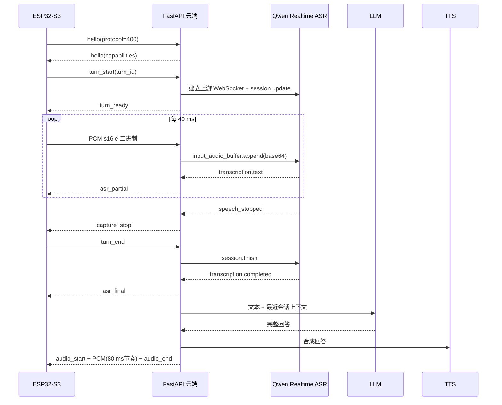

# 阶段四云端：实时语音对话基础版

版本：`v4.0.0-realtime-foundation`

本阶段把云端从“录完一整段后同步处理”升级为可持续演进的实时会话框架：ESP32 的 PCM 音频可在录音过程中转发到 Qwen-ASR-Realtime，云端向设备返回局部识别文本，并把 ASR/LLM/TTS 处理放入可取消的后台任务。旧版协议仍可使用批量 ASR 回退链。

> 当前是“实时 ASR + 可打断半双工”的基础版，不是带声学回声消除的真全双工。LLM 和 Edge TTS 仍按完整文本生成，后续阶段再改为 token/句子级流水线。

## 1. 本阶段已经实现

- 协议版本提升到 `400`，增加 `hello`、`turn_start`、`turn_end`、`turn_ready`、`capture_stop`、`asr_partial`、`asr_final`、`turn_cancelled`。
- 保留 `start_record`、`finish_record`、`vad_end`、`asr_text` 等 v3 消息兼容。
- 新增 Qwen-ASR-Realtime WebSocket 适配器，一轮对话使用一个上游 ASR 连接。
- 实时识别不可用、超时或没有最终文本时，自动回退到现有批量 ASR/Vosk 链。
- ASR/LLM/TTS 在后台任务中运行；WebSocket 接收循环可以继续接收 `cancel` 和新一轮 `turn_start`。
- 每个连接保留最近若干轮对话上下文，传入 OpenAI-compatible/DeepSeek LLM。
- TTS PCM 按 80 ms 节奏下发，避免一次性灌满 ESP32 播放队列，也让取消能快速生效。
- 修正不可安装的 `vosk==0.3.45` 为 `0.3.44`，并显式加入 `websockets` 依赖。
- 删除未被调用的旧转写包装函数和无效的 `VAD_MIN_RECORDING_BYTES` 配置。

## 2. 当前数据流



## 3. 代码结构

当前结构在不破坏 v3 的前提下做了最小可发布改造：

```text
app/
├── main.py                         # WebSocket、会话状态、后台 turn 任务、LLM/TTS
├── core/
│   ├── audio_utils.py              # PCM 质量分析
│   ├── model_config.py             # 模型配置
│   └── vad.py                      # 本地回退 VAD
└── providers/asr/
    ├── qwen_realtime.py             # 新增：Qwen 实时 ASR 会话
    ├── qwen_dashscope.py             # 批量 Qwen ASR 回退
    ├── vosk_local.py                 # 离线回退
    └── factory.py                    # 批量 ASR 策略链
```

后续建议按下面目录继续拆分，避免 `app/main.py` 再次膨胀：

```text
app/
├── api/ws.py                        # 只负责协议收发和鉴权
├── protocol/messages.py             # v4 消息校验和序列化
├── session/controller.py            # turn 生命周期、取消、超时
├── services/dialog_pipeline.py      # ASR -> LLM -> TTS 流水线
├── providers/asr/
├── providers/llm/
├── providers/tts/
└── observability/metrics.py          # 首包延迟、错误率、队列深度
```

拆分顺序应为：先搬运且保持测试通过，再定义接口，最后替换实现；不要一次同时重写协议和供应商适配器。

## 4. VPS 部署步骤

### 4.1 准备环境

推荐 Ubuntu 22.04/24.04、Docker Engine 和 Docker Compose v2。开放业务端口前，先准备域名和 TLS；生产环境不要让 ESP32 通过明文公网 `ws://` 传输 token 和语音。

```bash
git clone https://github.com/nvnmvm/esp32-s3-AIchat.git
cd esp32-s3-AIchat
cp .env.example .env
openssl rand -hex 32
```

把生成值写到 `.env` 的 `WS_TOKEN`。

### 4.2 配置 Qwen 实时 ASR

在阿里云百炼创建 API Key，确认业务空间所在地域，取得 Workspace ID。北京和新加坡业务空间不能混用域名。

```env
DASHSCOPE_API_KEY=sk-xxxxxxxx
QWEN_REALTIME_ENABLED=true
QWEN_REALTIME_WORKSPACE_ID=ws-xxxxxxxx
QWEN_REALTIME_REGION=cn-beijing
QWEN_REALTIME_MODEL=qwen3-asr-flash-realtime
QWEN_REALTIME_VAD_SILENCE_MS=400
QWEN_REALTIME_CONNECT_TIMEOUT_SECONDS=10
QWEN_REALTIME_FINISH_TIMEOUT_SECONDS=8
```

如果使用阿里云提供的自定义完整地址，可填写 `QWEN_REALTIME_WS_URL`；代码会在没有 `model` 查询参数时自动补上。正常情况下建议只填 Workspace ID 和地域。

官方事件依据：

- [Qwen-ASR Realtime WebSocket 交互流程](https://help.aliyun.com/zh/model-studio/qwen-asr-realtime-interaction-process)
- [客户端事件](https://help.aliyun.com/zh/model-studio/qwen-asr-realtime-client-events)
- [服务端事件](https://help.aliyun.com/zh/model-studio/qwen-asr-realtime-server-events)

### 4.3 配置 LLM 和 TTS

DeepSeek/OpenAI-compatible 示例：

```env
LLM_PROVIDER=auto
DEEPSEEK_API_KEY=sk-xxxxxxxx
DEEPSEEK_API_BASE=https://api.deepseek.com
DEEPSEEK_MODEL=deepseek-chat
CONVERSATION_MAX_TURNS=5

TTS_PROVIDER=edge
EDGE_TTS_VOICE=zh-CN-XiaoxiaoNeural
TTS_PCM_CHUNK_MS=80
```

`CONVERSATION_MAX_TURNS=5` 表示当前 WebSocket 连接最多向 LLM 携带最近 5 轮问答。连接断开后内存上下文会清空，当前版本不会把对话内容长期写入数据库。

### 4.4 启动和检查

```bash
docker compose up -d --build
docker compose ps
curl -fsS http://127.0.0.1:8000/health | python3 -m json.tool
docker compose logs -f --tail=200
```

健康检查应至少看到：

```json
{
  "ok": true,
  "version": "v4.0.0-realtime-foundation",
  "phase": "realtime-foundation",
  "protocol": 400,
  "qwen_realtime": {
    "enabled": true,
    "configured": true,
    "workspace_configured": true
  }
}
```

`configured=false` 不会让服务启动失败，但实际对话会回退到批量 ASR，ESP32 的 `turn_ready.realtime_asr` 也会是 `false`。

### 4.5 使用 Caddy 提供 WSS

示例 `Caddyfile`：

```caddyfile
voice.example.com {
    reverse_proxy 127.0.0.1:8000
    encode zstd gzip
}
```

ESP32 配置改为：

```cpp
#define WS_HOST "voice.example.com"
#define WS_PORT 443
#define WS_USE_SSL true
```

只在防火墙开放 80/443；不要把 8000 直接暴露给公网。正式设备还应校验服务器证书，后续版本再加入设备级短期 token。

## 5. 协议 v4

### 5.1 握手

设备连接后发送：

```json
{"type":"hello","protocol":400,"firmware":"v4.0.0-realtime-foundation","device_id":"esp32-s3-voice-001"}
```

云端返回能力列表。为了兼容旧固件，连接建立时云端仍先发送 v3 风格的 `status=idle`，只有设备主动发送 `hello` 才返回 v4 握手。

### 5.2 一轮对话

```json
{"type":"turn_start","protocol":400,"turn_id":1,"audio":{"format":"pcm_s16le","sample_rate":16000,"channels":1,"chunk_ms":40}}
```

收到 `turn_ready` 后持续发送 16 kHz、单声道、16-bit little-endian PCM 二进制。服务端 VAD 检测到结尾时返回：

```json
{"type":"capture_stop","reason":"server_vad","turn_id":1}
```

设备停止采集并发送：

```json
{"type":"turn_end","protocol":400,"turn_id":1,"reason":"server_vad"}
```

### 5.3 打断

```json
{"type":"cancel","protocol":400,"turn_id":1,"reason":"barge_in"}
```

云端会取消后台任务、关闭该轮 Qwen 连接并返回 `turn_cancelled`。设备可以紧接着发新的 `turn_start`；所有带 `turn_id` 的旧轮事件都应丢弃。

## 6. 本地验证

```bash
python3.12 -m venv .venv
. .venv/bin/activate
pip install -r requirements-dev.txt
pytest -q
python -m compileall -q app tests
```

实时供应商测试使用假的 WebSocket，不消耗云 API。上线前还需要用真实设备完成：

1. OLED 在说话时出现 `asr_partial` 文本。
2. 停止说话约 400 ms 后收到 `capture_stop`。
3. 播放过程中再次唤醒，旧音频在 300 ms 量级内停止。
4. 日志中旧 turn 不会覆盖新 turn 的状态。
5. 断开 Qwen 网络后仍能走批量 ASR 回退。

## 7. 延迟目标和观测

建议记录四个时间戳：`turn_start`、首个 `asr_partial`、`asr_final`、首个 TTS PCM。阶段四基础版的可接受目标：

| 指标 | 目标 |
| --- | ---: |
| 首个局部识别 | 800 ms 内 |
| 说完到 ASR final | 1.2 s 内 |
| ASR final 到回答文本 | 2.5 s 内 |
| 回答文本到首段音频 | 1.5 s 内 |
| 播放打断生效 | 300 ms 内 |

这些是工程验收目标，不是供应商 SLA。实际值受 Wi-Fi、VPS 地域、模型和文本长度影响。

## 8. 下一阶段

按优先级继续：

1. 把 LLM 调用改为 SSE/token 流，并按完整句子切片。
2. 接入支持流式 PCM 的 TTS；第一句生成后立即播放，后续句并行合成。
3. 用发送队列统一 WebSocket 出站顺序，补充队列上限和背压指标。
4. 将 `main.py` 拆为 protocol/session/services/providers。
5. 增加 Prometheus 指标、连接限流、设备级鉴权和 TLS 证书固定。
6. 真全双工前先评估 AEC；没有回声消除时不要在扬声器播放期间持续上传麦克风。
